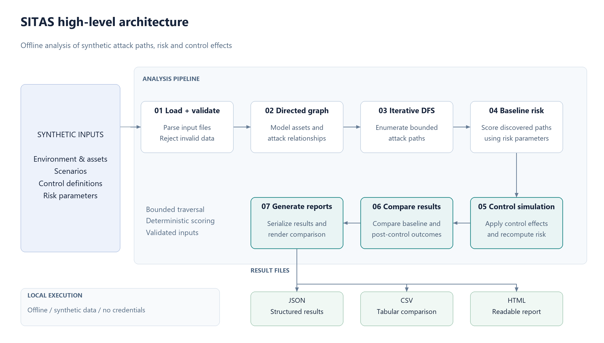

# SITAS

Sunhaven Identity Threat and Attack-Path Simulator

SITAS is an educational cybersecurity prototype for analysing identity attack
paths in a fictional Sunhaven Care environment. It uses locally defined synthetic
models, explores directed attack paths, scores exposure and simulates defensive
controls. It is an individual capstone workstream for COIT13236.

This is an educational cybersecurity prototype using fictional/synthetic data.
Scores describe model assumptions and are not probabilities or production security
assurance. No operational accounts, credentials or resident records are required.

## Development status

Phase 1 establishes the requirements, threat model, architecture and repository.
Implementation and execution evidence will be added progressively after validation.

## Design

- [System design](docs/design/system-design.md)
- [Requirements](docs/requirements/functional-requirements.md)
- [Threat model](docs/threat-model/threat-model.md)
- [Development plan](docs/development-plan.md)
- [Development journal](evidence/Development-Journal.md)
- [Phase completion register](evidence/Phase-Completion-Register.md)

## Repository organisation

`src/` contains software; `config/` contains model, risk and control definitions;
`scenarios/` contains attack scenarios; `tests/` contains automated checks;
`reports/` contains generated JSON, CSV and HTML; `docs/` contains engineering
documentation and editable diagrams; `evidence/` contains actual execution logs,
phase records and screenshots; `scripts/` contains repeatable development tools.

Requires Python 3.11 or newer. The intended simulator runtime uses only the Python
standard library. Development dependencies are listed in `requirements.txt`.
