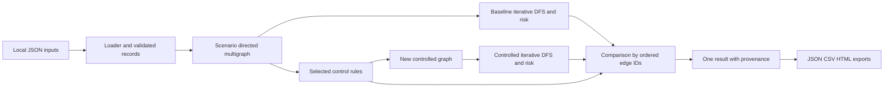

# SITAS system design

SITAS is an educational Python application for analysing identity attack paths in the fictional Sunhaven Care environment. It validates local synthetic JSON, discovers bounded routes to a protected asset, calculates explainable ordinal risk and compares routes after selected controls. This document describes the implemented system; execution evidence remains in the testing and evidence records.

## Problem and objectives

The care-setting model includes workers, agency identities, shared devices, protected information and privileged administration. An access diagram alone does not explain how weaknesses combine to expose an asset. SITAS makes those combinations explicit as directed paths with identifiers, readable preconditions and scores.

The application validates inputs, enumerates simple paths, preserves parallel mechanisms, applies transparent block/cap rules, retains blocked-path explanations and generates consistent JSON, CSV and HTML. It performs no discovery, authentication, scanning or live control enforcement.

## Architecture and execution

The analysis and report runtime uses the Python standard library. Python 3.11+ is the compatibility target; recorded development execution used Python 3.12.14. That record does not establish testing on other versions. Native Draw.io authoring and export is required for final diagram deliverables and remains pending. Earlier custom-rendered PNGs were archived privately outside the repository and are not final deliverables or evidence of native export.

`src.sitas.analyse(...)` returns a result dictionary without writing reports. `python -m src.sitas` is the CLI; `scripts/generate_reports.py` exposes the same interface from another working directory. Defaults resolve to `config/environment.json`, `config/controls.json`, `config/risk-model.json` and `scenarios` beneath the repository. Every scenario file is loaded and validated before scenario selection is applied.

The CLI accepts `--controls all`, `--controls none`, or comma-separated control IDs. Repeated `--scenario` arguments narrow selection. Unknown selections fail. `--list-scenarios` validates the environment and scenarios, lists them and writes no report. [Component design](component-design.md) gives exact contracts and limits.

## Model and processing sequence

The loader produces frozen records in canonical ID order. Node attributes are copied into read-only mappings and tuples. Graph construction retains all environment nodes and selects the scenario's allowed edges, so unused nodes can appear as isolated nodes. Sorted, read-only node/edge maps and adjacency tuples preserve parallel edges as distinct transitions.

An edge explanation states an assumed prerequisite; tags identify control conditions. Names and explanations are data, never executable expressions. Scenarios select existing relationships rather than discover or create external data.

For each selected scenario the coordinator:

1. Builds its baseline graph and enumerates bounded simple paths.
2. Applies selected controls to a new graph and records every matched rule.
3. Enumerates the controlled graph with the same bounds.
4. Scores and compares baseline/surviving paths by ordered edge-ID tuple.
5. Retains one finding per baseline path, including disappeared paths and reasons.
6. Aggregates scenario-path findings into a result with provenance.

The baseline remains unchanged, so later selections do not inherit earlier control modifications.

## Search scope and identity

Iterative DFS maintains the current route, an iterator stack and a visited-node set for that route. Backtracking removes nodes from the set, allowing alternatives through shared nodes. Reaching the target ends that path. Parallel edges yield distinct paths even when node sequences match.

Defaults are **12 edges of depth, 10,000 paths and 100,000 examined edge expansions**, independently for each scenario's baseline and controlled search. Depth is an explicit scope boundary: excluded extensions increment `depthPruned`, which counts transitions rather than omitted complete paths. Exceeding a path or expansion budget raises `SearchLimitError` and aborts analysis without presenting partial findings as complete.

The ordered edge tuple is canonical path identity. `path_id(...)` derives a stable `SITAS-AP-` identifier from its SHA-256 digest. Finding IDs also incorporate the scenario ID. These shortened digest labels are deterministic, not mathematically collision-free or security attestations.

## Risk, controls and comparison

Path likelihood is the minimum edge ordinal from 1 to 5. Target impact is its configured integer from 1 to 5. Their product maps to Low 1-4, Medium 5-9, High 10-16 or Critical 17-25. The minimum is a **bottleneck ordinal convention**, not a conservative bound, measured likelihood or probability.

A selected rule matches its tag and, when supplied, the edge's target-node selector. Blocks remove edges; caps take the minimum original score and all matching caps. Blocking dominates. No control adds nodes, edges or attack mechanisms. A relevant control matches a path from the configured catalogue; an applied control has a selected matching rule.

Findings are blocked, reduced or unchanged. Blocked findings retain baseline risk and ordered paths with `residual: null`. A surviving path is reduced only when its recalculated score is lower. A cap on a non-minimum edge can leave path risk unchanged while remaining visible in the explanation.

`controlEffects` records individual rule results against original edge scores. Ordered `edgeDetails` records original and **combined** controlled likelihoods. Two caps may report individual `5 -> 3` and `5 -> 2` effects while the effective edge value is 2; any block gives a combined value of `null`. These operands expose the path-minimum and impact calculation.

Counts reconcile as baseline = blocked + remaining, and remaining = reduced + unchanged. Exposure sums path scores. Shared edges/assets, including across scenarios, mean totals and percentage changes are comparison indices, not independent incident counts, probabilities or expected financial losses.

## Reports and provenance

Default exports are:

- `reports/json/sitas-findings.json`
- `reports/csv/sitas-findings.csv`
- `reports/html/sitas-threat-assessment.html`

`--output` changes their common root. JSON schema version 1 preserves the complete result. CSV has one finding per row, compact structured JSON, flattened risk and run identifiers. HTML presents summaries, scenarios, residual ranking, every ordered path and edge rationale, controls, bounds, metadata, assumptions and limitations. UTF-8 HTML escapes text/attributes, contains no scripts or network-loaded assets and links only eligible HTTP/HTTPS references. CSV neutralises formula-like scalar text; JSON retains original strings.

`inputFingerprint` hashes canonical validated environment, all configured controls, risk model and selected scenarios. `engineFingerprint` hashes all direct `src/*.py` source texts with normalised line endings. `simulationId` combines both fingerprints and settings, excluding timestamp. It is not a Git commit ID and does not fingerprint dependencies, the interpreter or every repository file.

`generatedAt` defaults to actual UTC time. An explicit timezone-aware `--timestamp` normalises to UTC for reproducible exports; it is supplied metadata, not independent execution-time evidence. Fixed result objects render deterministically. Input JSON formatting does not affect the validated snapshot; meaningful values and ordered attribute arrays can.

All formats render before filesystem writes and all temporary outputs are staged before replacement. Replacement is atomic per file, **not one transaction across three files**. A later failure can leave complete files from different runs; validation/search failure leaves older reports untouched. Check run IDs and timestamps after failure and rerun successfully for a consistent set. See [Report contract](report-contract.md).

## Recorded example and validation boundary

The [Phase 8 report-generation record](../../evidence/logs/phase08-report-generation.execution.json) and [saved JSON report](../../reports/json/sitas-findings.json) record 15 baseline paths, 12 blocked and three residual paths with all supplied controls. The remaining assumptions concern MFA approval, an authorised agency operator and an authorised support export. [Assumptions and limitations](../limitations/assumptions-and-limitations.md) explains them.

That evidence describes the supplied model and recorded run. Finite tests and fixtures do not establish correctness for every possible model or validate real-world assumptions. Native Draw.io deliverables remain a separate, pending part of Phase 9.
