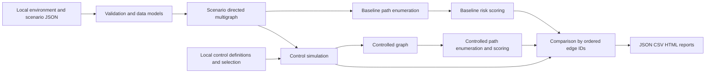

# SITAS system design

SITAS is an educational Python application for analysing identity attack paths in the fictional Sunhaven Care environment. It loads local JSON, discovers ways a simulated attacker can reach a protected asset, assigns an explainable ordinal risk score, and compares the same scenario after selected security controls. The design supports a repeatable laptop demonstration and reports that a reader can trace back to the model.

This document defines the implementation contract. Execution evidence and test results belong in the testing and evidence records; design statements do not establish that a feature has passed testing.

## Problem and objectives

Sunhaven represents a care setting with permanent and agency workers, sensitive resident information, shared devices and privileged administration. A diagram showing authentication and access controls alone cannot explain the combinations of weaknesses that expose an asset. SITAS makes those combinations explicit as directed paths through a synthetic model.

The objectives are to validate the model, enumerate bounded simple paths, calculate transparent risk indicators, apply explicit control rules, preserve explanations for blocked paths, and produce consistent JSON, CSV and HTML results. Every input and output concerns a fictional simulation.

## Architecture

Python 3.11 or later and the standard library provide the runtime. Dataclasses represent validated nodes, edges, scenarios and controls. JSON configuration remains separate from source code. Test tooling is a development dependency rather than a simulation service. The report can be opened locally without a web server or network connection.

## Input contracts

| Input | Required meaning | Validation obligations |
| --- | --- | --- |
| Environment | Synthetic environment identity; nodes; directed edges | Unique stable IDs; known node types; nonempty descriptions; valid endpoints; integer likelihood values from 1 to 5; asset impact from 1 to 5 |
| Scenario | Stable scenario ID; title; source; target; allowed edge IDs | Referenced nodes and edges exist; target is a protected asset; source and target are distinct; selected edges form the scenario graph |
| Controls | Stable control IDs; names; explicit rules; explanations | Supported actions only; well-formed tag and target selectors; likelihood caps in the permitted range |
| Risk model | Ordinal likelihood and impact scales; severity ranges | Required scale and severity coverage; no gaps or overlapping ranges |
| Run settings | Scenario selection; control selection; maximum depth; resource limits | Valid selections and positive integer limits; reject unknown controls or scenarios |

A scenario selects edges from one common environment; it does not discover data from external systems. An edge represents a transition whose stated preconditions are assumed within that scenario. Tags identify the security condition to which a control rule applies. IDs identify objects; display names and explanations are readable labels, never executable expressions.

The graph is a directed multigraph: two edges can have identical endpoints while representing different attack mechanisms. Their distinct IDs must survive graph construction, pathfinding and reporting.

## Processing sequence

1. Read and validate all selected configuration before analysis.
2. Construct the scenario graph from its allowed edge IDs and resolve its source and target.
3. Enumerate baseline simple paths using iterative depth-first search.
4. Score each path and retain its ordered nodes and edges.
5. Apply the selected controls to a separate graph representation and record every matched rule and effect.
6. Enumerate and score the controlled graph using the same path limits.
7. Match paths using their ordered edge IDs, classify their outcome and retain the baseline explanation for blocked findings.
8. Aggregate scenario metrics and write the three report formats from a common result object.

Keeping the baseline unchanged allows repeated control selections to be compared without accumulated state from an earlier run.

## Pathfinding and identity

An iterative DFS stack holds the current node, ordered edge sequence and the nodes visited on that path. An edge is eligible only if its destination has not already appeared on the current path. A global visited-node set is unsuitable because it would suppress alternative routes that legitimately share nodes. Adjacency traversal is ordered by stable edge ID.

Maximum depth is measured in edges and is an explicit analysis bound. Paths longer than that bound are outside the run's scope. The run also has limits on work or results so a large graph cannot grow without restraint. Exhausting a resource limit raises an explicit analysis error; a partial search must not be presented as a complete safe result. A report of zero paths means zero paths found within the declared model and depth bound.

The ordered edge-ID tuple is the canonical path identity. A stable report path ID is derived from that identity; display ordering must not change identity. Parallel edges therefore yield distinct paths even when the node sequence is identical. Findings also carry their scenario ID so that the same path in two scenarios is not confused with one record.

## Scoring and control semantics

Path likelihood is the minimum ordinal likelihood among its edges. Target impact is the protected asset's configured integer from 1 to 5. Risk is their product. Severity is Low for 1–4, Medium for 5–9, High for 10–16 and Critical for 17–25. These are educational ranking conventions, not calibrated probabilities or financial estimates.

A control rule matches explicitly tagged edges and any configured target selector. Its action either blocks the transition or caps its likelihood. Multiple caps compose by taking the minimum of the original likelihood and every matching cap. Blocking dominates caps. These rules are order independent and idempotent: changing control order or applying the same control twice does not compound a score reduction.

Controls do not add attack paths. An additional authentication requirement is represented by blocking a transition whose modeled prerequisite is missing, or by capping a transition representing a remaining bypass possibility. The simulator does not dynamically create a new authentication protocol.

## Comparison and reports

Each baseline finding becomes blocked, reduced or unchanged. A blocked finding retains its baseline score, ordered path and the edge/control reasons that prevented it. Its remaining exposure is represented separately; a blocked path is not a surviving Low-severity path. A surviving path is reduced only when its recalculated risk is lower. A rule can affect an edge while leaving the minimum path likelihood unchanged; that effect should remain visible without inventing a path-risk reduction.

Summary metrics include baseline, blocked and remaining path counts, reduced and unchanged counts, severity distributions, and highest-risk surviving paths. Aggregated counts are scenario-path records, not a count of independent real-world incidents. JSON retains structured findings and provenance; CSV provides one row per finding; HTML presents the threat assessment, comparison, explanations, assumptions and limitations. HTML escapes input-derived text and CSV protects spreadsheet consumers from formula-like values.

Analysis is deterministic for the same validated inputs and settings. Report timestamps describe generation time and are metadata; reproducibility checks should fix that metadata or compare the semantic analysis separately.

## Failure handling and validation approach

Malformed JSON, wrong types, duplicate IDs, missing references, unsupported rules and invalid limits must produce a clear error and an unsuccessful run. An unreachable target in a valid bounded graph is a valid zero-path analysis. Those outcomes must remain distinguishable.

Verification should combine focused unit tests for validation and algorithms, scenario tests for individual controls, and integration tests for report consistency and repeat execution. Actual execution results must be recorded after the corresponding implementation is run. Publication review should inspect source, fixtures, generated reports and history for secrets and private data.

## Development sequence

Design and requirements precede the synthetic model and loader. Graph construction follows validation; pathfinding follows graph construction; risk calculation follows path enumeration. Control simulation and comparison then extend the baseline analysis. Scenario completion, reporting, diagrams and documentation support the demonstration. Final validation records actual tests, results, logs and repository state. Each commit should describe work that exists when committed.
